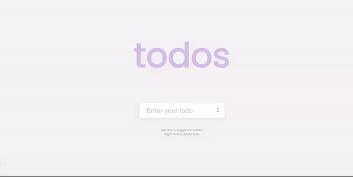

# TODO List

This is a simple web-based Todo List application that allows users to create, manage, mark as completed, and delete tasks. The project is built using HTML, CSS, and JavaScript, and it includes local storage functionality to store your tasks even after you close the browser.

[Deployed link here](https://iqbalahmadi.github.io/TODO-List/)  

## Features

- **Add Todos:** You can easily add as many tasks as you want by typing your task in the input field and clicking the "Add" button or pressing the Enter key.

- **Mark as Completed:** Left-click on a task to mark it as completed. A line-through style will be applied to completed tasks to distinguish them.

- **Delete Todos:** Right-click on a task to delete it. This action is irreversible, so be careful!

- **Local Storage:** The application stores your tasks in local storage, ensuring that your tasks are saved even if you close the browser or refresh the page.

## Usage

1. Open the Todo List application in your web browser by following the steps outlined in the "Getting Started" section.

2. To add a new task, type the task's description in the input field and either press the "Add" button or press Enter.

3. To mark a task as completed, simply left-click on it. The task text will have a line-through style applied to it to indicate completion.

4. To delete a task, right-click on it. Be cautious, as this action is irreversible.

5. Your tasks will be automatically saved to local storage, so you can close the browser and come back later to see your tasks intact.

## Local Storage

The Todo List application uses the browser's local storage to persist your tasks. This means that your tasks will be saved on your device, even if you close the browser or refresh the page. This feature ensures that you don't lose your tasks and can access them at any time.
